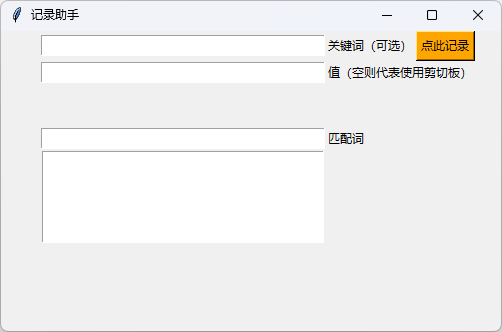

# 记录助手

## 1. 介绍

记录助手主要用于记录工作生活中遇到的`小记忆点`，通过`关键词`+`内容`的形式存储在一个excel表里。当你需要翻阅记录时，只要输入你脑海里能想到的词即可，结果大部分时候会让你满意。

| 时间       | 贡献者  | 描述       |
| ---------- | ------- | ---------- |
| 2024/09/21 | Manfred | 初版，能用 |


## 2. 使用

**环境**

纯`python`实现，界面用`tkinter`搭建，可以跨平台使用。建议3.2以上版本使用，遇到缺少的库使用pip命令安装（替代`fuzzywuzzy`）:

```shell
pip install fuzzywuzzy -i https://pypi.tuna.tsinghua.edu.cn/simple
```

**界面**



**方法**

- 记录：

  按照`关键词`+`内容`的方式存储记忆点，当然也可以不输入`关键词`，比较随意。`值`也可以不输入，不输入就自动存剪切板第一条，输入就按输入的存

- 查找：

  用模糊匹配的方式，计算`关键词`+`内容`组合的匹配度，将最契合的匹配结果呈现出来。点哪条结果，哪条结果就被复制到剪切板


## 3. 定制

*都在这了*

```python
name = '记录助手'
independent = 1 # 0：作为模块，1：单独使用
recordPath = 'record.xlsx' # 保存数据的默认路径
listBoxLength = 5 # 每次抓取记录数据的条目数量
windowSize = [500, listBoxLength * 20 + 200]
logging.basicConfig(level=logging.DEBUG)
```


